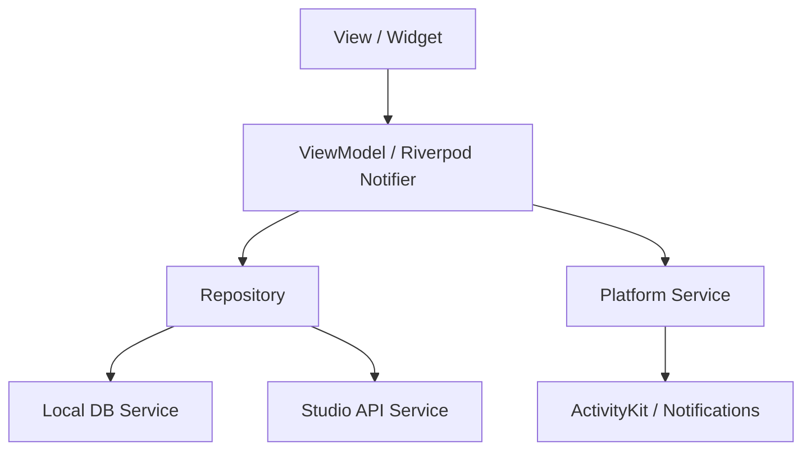
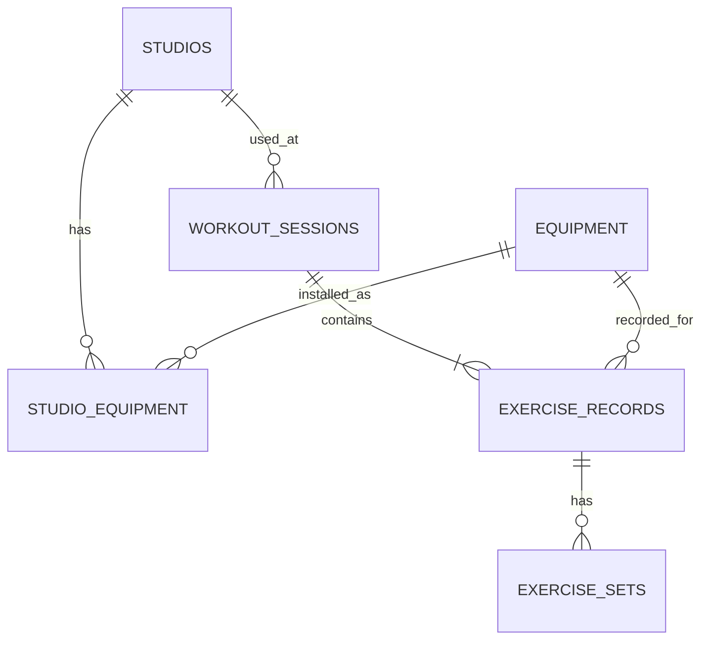
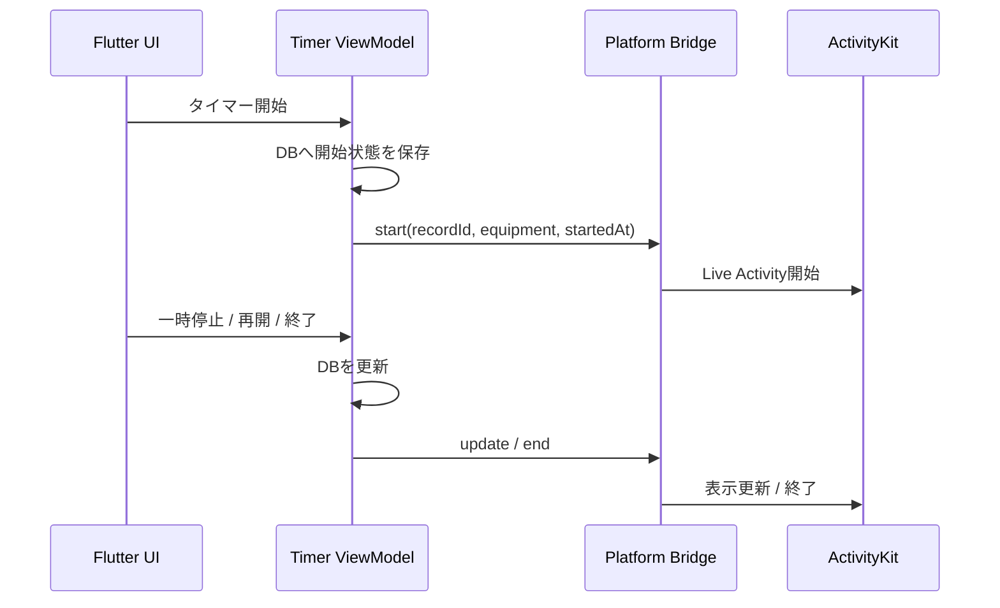

# chocoLOG Flutterアーキテクチャ（Draft v0.1）

- 作成日: 2026-08-11
- 対象: iOS MVP、将来のAndroid対応
- ステータス: 初期構成確定
- 関連資料: [要件定義書](./requirements.md) / [画面構成・ワイヤーフレーム](./wireframes.md)

## 1. 方針

- FlutterでiOSを先行開発し、Androidへ展開できる構造にする
- ローカルDBを正とするオフラインファースト構成にする
- UI、状態・画面ロジック、データ取得・保存を分離する
- 機能単位でコードを配置し、変更範囲を小さく保つ
- Live Activity等のOS固有機能は専用の境界を設ける
- MVPでは独自バックエンドやユーザー認証を導入しない
- パッケージのバージョンはプロジェクト作成時に互換性を確認して固定する

## 2. 採用技術

| 領域 | 採用案 | 用途 |
|---|---|---|
| UI | Flutter / Material 3 | iOS・Android共通UI |
| 状態管理・DI | Riverpod | 画面状態、依存関係、非同期状態 |
| ルーティング | go_router | ボトムナビゲーション、トレーニングフロー、ディープリンク |
| ローカルDB | Drift + SQLite | セッション、器具、セット、店舗キャッシュ |
| 軽量設定 | shared_preferences | オンボーディング完了、表示設定等 |
| モデル | Freezed + json_serializable | 不変モデル、APIデータ変換 |
| HTTP | package:http | 店舗・器具データの取得 |
| 通知 | ローカル通知プラグイン | 曜日・時刻リマインダー、経過通知 |
| iOS固有 | ActivityKit / WidgetKit / SwiftUI | Live Activity、Dynamic Island |
| テスト | flutter_test / integration_test | 単体、Widget、主要フロー |

## 3. アーキテクチャ

Flutter公式の推奨構成を参考に、UI層とデータ層を分離する。MVPでは不要な抽象化を避け、複数機能をまたぐ複雑な処理に限ってUseCaseを導入する。



### View

- Widgetの描画とユーザー操作の受け取りを担当する
- DBやHTTP APIを直接呼び出さない
- 分岐は表示状態に関する単純なものに限定する
- ViewModelが公開する状態と操作を利用する

### ViewModel

- 画面状態と入力状態を管理する
- Repositoryから取得したデータを画面表示用へ変換する
- 保存、コピー、タイマー開始等の操作を公開する
- Flutter Widgetを直接保持しない

### Repository

- アプリ内データの正となる
- キャッシュ、エラー処理、外部データから内部モデルへの変換を担当する
- 外部APIのレスポンス形式をUIへ露出させない
- 各Repositoryは別Repositoryへ直接依存しない

### Service

- SQLite、HTTP、通知、ActivityKit等の外部境界をラップする
- 可能な限り状態を持たず、入出力を明確にする
- テストでは差し替え可能なインターフェースを用意する

## 4. ディレクトリ構成

```text
lib/
├── app/
│   ├── app.dart
│   ├── bootstrap.dart
│   ├── router.dart
│   └── theme.dart
├── core/
│   ├── database/
│   │   ├── app_database.dart
│   │   ├── migrations/
│   │   └── tables/
│   ├── errors/
│   ├── live_activity/
│   ├── notifications/
│   ├── time/
│   └── widgets/
├── features/
│   ├── onboarding/
│   ├── home/
│   ├── studios/
│   ├── equipment/
│   ├── workout/
│   ├── history/
│   ├── reports/
│   └── settings/
└── main.dart

test/
├── unit/
├── widget/
└── fixtures/

integration_test/
└── workout_flow_test.dart
```

各featureは必要な範囲で次の構成を採用する。

```text
features/workout/
├── data/
│   ├── workout_repository.dart
│   └── workout_repository_impl.dart
├── domain/
│   ├── exercise_record.dart
│   ├── exercise_set.dart
│   └── workout_session.dart
└── presentation/
    ├── workout_screen.dart
    ├── workout_view_model.dart
    └── widgets/
```

小さいfeatureでは空の階層を作らず、ファイルが増えた時点で分割する。

## 5. 画面ルーティング

### 通常ナビゲーション

`StatefulShellRoute`相当の構造で、次の4ブランチを保持する。

```text
/home
/history
/reports
/settings
```

### トレーニングフロー

トレーニング中はルートNavigatorへ全画面表示し、ボトムナビゲーションを隠す。

```text
/workout/studio
/workout/equipment
/workout/strength/:equipmentId
/workout/bodyweight/:equipmentId
/workout/cardio/:equipmentId
/workout/session
/workout/review
/workout/complete/:sessionId
```

### ディープリンク

Live Activityタップ時は、進行中の有酸素記録へ遷移する。

```text
chocolog://workout/cardio/:recordId
```

ログインによるリダイレクトはMVPでは不要。オンボーディング未完了時だけ`/onboarding`へ遷移させる。

## 6. 状態管理

### 永続状態

- トレーニングセッション
- 種目記録・セット
- 器具マスタ
- 店舗と店舗器具のキャッシュ
- お気に入り店舗・器具
- 週目標とリマインダー

記録に関する永続状態はDriftへ保存する。

### 一時状態

- 現在選択中の重量・回数
- 器具検索キーワード
- レポートの週/月表示
- 画面上の開閉状態

一時状態はRiverpod Providerで管理し、プロセス終了後の復元が不要なものはDBへ保存しない。

### 進行中セッション

進行中セッションは一時状態として扱わず、作成時点からDBへ保存する。

- セッション開始時に`draft`状態で保存
- セット追加・編集のたびに即時保存
- 有酸素タイマー開始時に開始時刻と状態を即時保存
- 完了時に`completed`へ変更
- 破棄時は明示確認後に削除または`discarded`へ変更

これにより、バックグラウンド移行や強制終了後も復元できる。

## 7. データベース

### 主要テーブル

```text
equipment
studios
studio_equipment
workout_sessions
exercise_records
exercise_sets
user_preferences
reminder_schedules
```

### 主な関連



### マイグレーション

- DBにはschemaVersionを持たせる
- 既存記録を削除せず段階的に移行する
- マイグレーションごとにテストを作る
- 外部店舗IDとアプリ内UUIDを分離する

## 8. タイマー設計

画面更新回数ではなく時刻差分で経過時間を算出する。

保存項目:

- startedAt
- pausedAt
- accumulatedPausedSeconds
- timerStatus（running / paused / completed）

表示時の計算:

```text
経過時間 = 現在時刻 - 開始時刻 - 一時停止累計時間
```

- タイマー開始・一時停止・再開・終了のたびにDBを更新する
- アプリ復帰時にDBから状態を読み込み、現在時刻との差分を再計算する
- 端末時刻が大きく変化した場合は、ユーザーが終了時刻を修正できるようにする

## 9. Live Activity

Live ActivityはFlutter Widgetでは作成せず、iOSのWidget Extension内でSwiftUIを使って構築する。



### 表示内容

- 器具名
- 経過時間
- 実行中・一時停止状態
- アプリへ戻る導線

### 実装条件

- ActivityKitを利用できないOSでは何もしない
- ActivityKitの失敗が記録やタイマーを止めない
- DBを正とし、Live Activityは表示手段として扱う
- MVPではサーバーからのPush更新を使わない

## 10. 店舗・器具データ

外部APIは仕様が保証されていないため、アダプター層で隔離する。

```text
StudioApiService
      ↓ 外部レスポンス
StudioMapper
      ↓ アプリ内モデル
StudioRepository
      ↓ キャッシュ・フォールバック
ViewModel
```

- APIレスポンスを直接Driftテーブルや画面へ渡さない
- 取得済みデータをSQLiteへキャッシュする
- 最終更新日時を保持する
- 更新はユーザー操作時または十分な間隔を空けて実行する
- 取得失敗時はキャッシュ、それもなければ全器具マスタを使う
- 公式画像URLは保存・表示しない

## 11. 通知

### 週間リマインダー

- ユーザーが指定した曜日・時刻でローカル通知を予約する
- 通知タップでホームへ遷移する
- 通知権限がない場合は設定画面へ案内する

### タイマー経過通知

- MVPではLive Activityを主とする
- 停止忘れ対策の経過通知は設定可能な補助機能とする
- 筋トレセット保存時の休憩通知は行わない

## 12. エラー処理

| エラー | 動作 |
|---|---|
| DB保存失敗 | 入力を画面に保持し、再試行を提示 |
| 店舗API失敗 | キャッシュまたは全器具一覧へ切り替え |
| 通知権限拒否 | 記録機能を継続し、設定画面に状態表示 |
| Live Activity開始失敗 | アプリ内タイマーのみ継続 |
| 進行中セッション検出 | ホームに「記録を続ける」を表示 |
| 不正な5kg単位 | 保存せず、近い有効値を提示 |

ユーザーが対処できない技術的な詳細は直接表示せず、開発用ログへ記録する。

## 13. テスト方針

### Unit Test

- 重量の5kg単位バリデーション
- 前回セットのコピー
- 週目標の集計
- セッション・器具別集計
- タイマーの一時停止を含む経過時間計算
- 店舗APIレスポンスの変換

### Widget Test

- 重量・回数のクイック入力
- 1セット追加と3セット一括追加
- 自重系で重量入力が表示されないこと
- 前回セットコピー後の個別編集
- 空状態とエラー状態

### Integration Test

1. オンボーディングを完了する
2. 店舗と器具を選択する
3. 筋トレを3セット記録する
4. 有酸素タイマーを記録する
5. セッションを保存する
6. 履歴・レポートへ反映されることを確認する
7. アプリ再起動後に記録が残ることを確認する

Live ActivityはiOS実機または対応Simulatorでネイティブ側のテストを行う。

## 14. 初期実装順

1. Flutterプロジェクトとテーマ
2. DriftスキーマとRepository
3. ルーティングと通常4タブ
4. オンボーディング
5. 筋トレ記録フロー
6. 有酸素タイマー
7. Live Activity
8. 履歴・レポート
9. 店舗API・キャッシュ
10. 通知・設定
11. 統合テストとTestFlight配布準備

筋トレ記録を先に完成させ、主要価値を実機で検証してから周辺機能を接続する。
