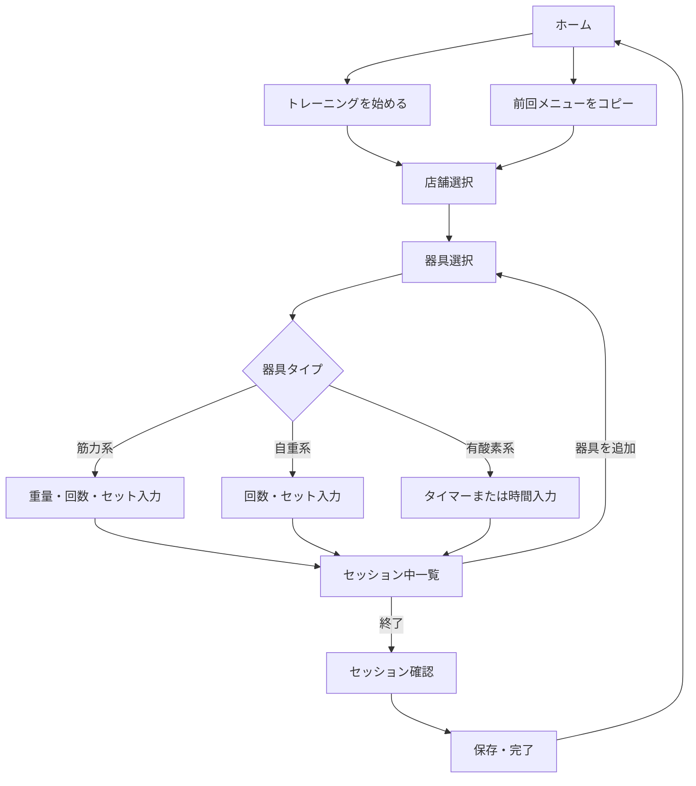

# chocoLOG 画面構成・ワイヤーフレーム（Draft v0.2）

- 作成日: 2026-08-11
- 対象: iOS MVP
- ステータス: 基本構成確定
- 関連資料: [要件定義書](./requirements.md)

## 1. 設計方針

- ジム内で片手でも素早く記録できることを最優先にする
- 通常利用する4画面と、トレーニング中の専用フローを分ける
- トレーニング中は誤操作を避けるため、ボトムナビゲーションを表示しない
- 入力内容は操作のたびに端末へ自動保存する
- 前回と同じ内容を繰り返す場合、コピーして数値だけ変更できるようにする
- 黄色をアクセントにした白基調の独自デザインとする

## 2. 画面一覧

### 通常画面

| ID | 画面 | 役割 |
|---|---|---|
| N-01 | オンボーディング | アプリ説明、週目標、通知、よく行く店舗の初期設定 |
| N-02 | ホーム | トレーニング開始、週目標、前回メニュー |
| N-03 | 履歴 | カレンダー、日別セッション、記録の確認・編集 |
| N-04 | レポート | 週・月集計、器具別の実績・推移 |
| N-05 | 設定 | 店舗、通知、週目標、単位、法務・データ情報 |

通常画面のボトムナビゲーションは、**ホーム / 履歴 / レポート / 設定**の4項目とする。

### トレーニングフロー

| ID | 画面 | 役割 |
|---|---|---|
| W-01 | 店舗選択 | 今回利用する店舗を選択。スキップ可能 |
| W-02 | 器具選択 | 店舗器具、お気に入り、最近使った器具から選択 |
| W-03 | 筋トレ記録 | 前回記録のコピー、重量・回数・セット入力 |
| W-04 | 自重トレーニング記録 | 回数・セット入力 |
| W-05 | 有酸素記録 | タイマー、時間手入力、距離等の任意入力 |
| W-06 | セッション中一覧 | 記録済み器具の確認、次の器具追加 |
| W-07 | セッション確認 | 全記録の確認・修正、保存 |
| W-08 | 完了 | 運動結果、週目標への反映、ホームへ戻る |

## 3. 主要フロー



## 4. 画面別ワイヤーフレーム

### N-02 ホーム

```text
┌─────────────────────────┐
│ 8月11日 火曜日       設定 │
│ こんにちは               │
│                         │
│ 今週 1 / 2回             │
│ ██████████░░░░░░░░░░     │
│ あと1回で目標達成         │
│                         │
│ [ トレーニングを始める ]  │
│                         │
│ 前回のメニュー     8月9日 │
│ チェストプレス            │
│ 20kg × 15回 × 3セット     │
│ ラットプルダウン          │
│ 20kg × 12回 × 3セット     │
│ トレッドミル       15分   │
│                         │
│ [ 前回と同じ内容で始める ]│
├─────────────────────────┤
│ ホーム  履歴  レポート 設定│
└─────────────────────────┘
```

要件:

- 「トレーニングを始める」を画面内で最も目立つ操作とする
- 今週の実績と目標を表示する
- 直近セッションの内容を表示する
- 前回メニュー全体をワンタップで今回へコピーできる
- 記録途中のセッションがある場合は「記録を続ける」を最優先表示する

### W-01 店舗選択

```text
┌─────────────────────────┐
│ 戻る       今回の店舗     │
│                         │
│ [ 店名・駅名で検索      ] │
│                         │
│ よく行く店舗             │
│ ● ○○駅前店        前回   │
│ ○ △△店                  │
│                         │
│ [ この店舗で続ける ]      │
│ 店舗を選ばずに続ける      │
└─────────────────────────┘
```

要件:

- 前回利用した店舗を初期選択する
- 店舗選択は必須にしない
- 外部店舗データを取得できない場合も、記録フローを継続できる
- 選択店舗はセッションに保存する

### W-02 器具選択

```text
┌─────────────────────────┐
│ 戻る        器具を選ぶ    │
│ ○○駅前店           変更   │
│ [ 器具名で検索          ] │
│                         │
│ 最近使った器具           │
│ [チェスト] [ラットプル]   │
│                         │
│ この店舗の器具           │
│ ☆ チェストプレス         │
│ ☆ ラットプルダウン       │
│ ☆ レッグプレス           │
│   アブベンチ             │
│   トレッドミル           │
│                         │
│ 全器具を見る              │
└─────────────────────────┘
```

要件:

- 表示優先順は「最近使用 → お気に入り → 選択店舗の器具 → 全器具」とする
- 外部データにない器具でも全器具一覧から選べる
- 器具を選ぶと、その種類に応じた記録画面へ遷移する

### W-03 筋トレ記録

```text
┌─────────────────────────┐
│ 戻る   チェストプレス 完了│
│                         │
│ 前回 20kg × 15回 × 3     │
│ [ 前回の3セットをコピー ] │
│                         │
│ 重量              20kg  │
│ [10] [15] [20] [25] kg  │
│ [ −5 ]   20kg    [ ＋5 ] │
│                         │
│ 回数               15回  │
│ [10] [12] [15] 回        │
│ [ −1 ]   15回    [ ＋1 ] │
│                         │
│ [ このセットを追加 ]      │
│ [ 同じ内容を3セット追加 ] │
└─────────────────────────┘
```

要件:

- 前回の同一器具のセット内容を常に上部へ表示する
- コピー後も各セットを個別に変更できる
- 重量は5kg単位のみ保存できる
- セット追加後、直前の重量・回数を次セットへ引き継ぐ
- 休憩タイマーは自動開始しない
- 操作ごとに入力状態を自動保存する

### W-04 自重トレーニング記録

W-03から重量入力を除き、「自重」と明示する。回数とセットだけを記録する。

### W-05 有酸素記録

```text
┌─────────────────────────┐
│ 戻る   トレッドミル  完了 │
│                         │
│       経過時間           │
│         12:48           │
│                         │
│ [ 一時停止 ] [ 終了 ]    │
│                         │
│ 距離             — km   │
│ 速度             — km/h │
│ 傾斜             — %    │
│                         │
│ [ タイマーを使わず入力 ]  │
└─────────────────────────┘
```

要件:

- 開始、一時停止、再開、終了を提供する
- タイマー状態は即時に端末保存する
- バックグラウンド・画面ロックをまたいで経過時間を算出する
- Live Activityに器具名、経過時間、状態を表示する
- 距離、速度、傾斜、負荷は任意入力とする
- タイマーを使わない時間の手入力も可能にする

### W-06 セッション中一覧

```text
┌─────────────────────────┐
│        今日の記録        │
│                         │
│ チェストプレス      編集  │
│ 20kg × 15回 × 3          │
│                         │
│ アブベンチ          編集  │
│ 自重 × 15回 × 3          │
│                         │
│ トレッドミル        編集  │
│ 15分・1.8km              │
│                         │
│ [ ＋ 別の器具を追加 ]     │
│ [ トレーニングを終了 ]    │
└─────────────────────────┘
```

要件:

- 記録済み器具を追加順に表示する
- 各記録を編集・削除できる
- 「別の器具を追加」と「トレーニングを終了」を明確に分ける
- アプリ再起動時はこの画面または直前の入力画面へ復帰する

### W-07 セッション確認・W-08 完了

- 保存前に全器具と記録内容を確認・修正できる
- 保存後は、実施器具数、筋トレセット数、有酸素時間を表示する
- 今週の目標進捗を更新して表示する
- 完了画面からホームまたは履歴へ移動できる
- 達成演出は短くし、スキップ操作を不要とする

### N-03 履歴

```text
┌─────────────────────────┐
│ 履歴          2026年8月  │
│                         │
│ 月 火 水 木 金 土 日      │
│    1  2  3 ●  5  6 ●    │
│  8 ● ● 11 12 13 14 15   │
│                         │
│ 8月11日の記録            │
│ 10:30 セッション         │
│ ・チェストプレス 20kg…   │
│ ・アブベンチ 自重…       │
│ ・トレッドミル 15分      │
│                         │
│ 18:20 セッション         │
│ ・バイク 10分            │
├─────────────────────────┤
│ ホーム  履歴  レポート 設定│
└─────────────────────────┘
```

要件:

- 記録日はカレンダー上で色と印の両方を使って表現する
- 同日の複数セッションを時刻別に表示する
- セッション詳細から編集、複製、削除ができる

### N-01 オンボーディング

オンボーディングは4ステップとし、各画面にスキップまたは後から変更できる導線を設ける。

#### Step 1: アプリ紹介

```text
┌─────────────────────────┐
│                         │
│         chocoLOG         │
│                         │
│ いつものトレーニングを   │
│ かんたんに記録           │
│                         │
│ ・筋トレの重量とセット    │
│ ・有酸素運動の時間        │
│ ・前回メニューをコピー    │
│                         │
│ [ はじめる ]             │
│ 非公式アプリについて      │
└─────────────────────────┘
```

- ログイン不要・端末保存であることを簡潔に案内する
- chocoZAP公式・公認アプリではないことを明記する
- 長い機能紹介カルーセルは設けない

#### Step 2: 週目標

```text
┌─────────────────────────┐
│ 1 / 3          週の目標  │
│                         │
│ 週に何回運動しますか？    │
│                         │
│ [ 週1回 ]                │
│ [ 週2回 ]  おすすめ       │
│ [ 週3回 ]                │
│                         │
│ [ 次へ ]                 │
└─────────────────────────┘
```

- 週2回を初期選択し「おすすめ」と表示する
- 設定画面から変更可能であることを補足する

#### Step 3: よく行く店舗

```text
┌─────────────────────────┐
│ 2 / 3      よく行く店舗  │
│                         │
│ [ 店名・駅名で検索      ] │
│                         │
│ 検索結果                 │
│ ○ ○○駅前店              │
│ ○ ○○二丁目店            │
│                         │
│ [ 次へ ]                 │
│ 今は設定しない            │
└─────────────────────────┘
```

- 複数店舗を登録できる
- 店舗API取得失敗時もスキップして開始できる
- よく使う器具はオンボーディングで設定させない

#### Step 4: リマインダー

```text
┌─────────────────────────┐
│ 3 / 3       リマインダー  │
│                         │
│ 運動するタイミングを      │
│ お知らせします            │
│                         │
│ 曜日  [ 火 ] [ 土 ]       │
│ 時刻       19:00         │
│                         │
│ [ 通知を設定して始める ]   │
│ 今は設定しない            │
└─────────────────────────┘
```

- 設定確定後にOSの通知許可ダイアログを表示する
- スキップした場合は通知許可を要求しない
- 拒否されてもホームへ進める

### N-04 レポート

```text
┌─────────────────────────┐
│ レポート                 │
│ [ 週 ] [ 月 ]             │
│                         │
│ 8月10日〜8月16日          │
│ 運動日数  1 / 2回         │
│ 筋トレ       12セット     │
│ 有酸素          25分      │
│                         │
│ よく使った器具            │
│ 1 チェストプレス  4回     │
│ 2 レッグプレス    3回     │
│                         │
│ 器具ごとの推移            │
│ [ チェストプレス       › ]│
├─────────────────────────┤
│ ホーム  履歴  レポート 設定│
└─────────────────────────┘
```

要件:

- `週 / 月`の切り替えを画面上部へ固定する
- 運動日数、筋トレセット数、有酸素時間を主要指標とする
- 週表示では目標回数に対する進捗を表示する
- よく使った器具を利用回数順に表示する
- 器具詳細で重量・回数・セット数の推移を確認できる
- 有酸素系は時間・距離の推移を確認できる
- 根拠の弱い消費カロリー推定は表示しない
- データがない場合はグラフ枠を表示せず、記録開始の導線を置く

#### 器具別レポート

```text
┌─────────────────────────┐
│ 戻る  チェストプレス      │
│                         │
│ 前回 20kg × 15回 × 3     │
│ 最大 25kg × 12回         │
│ 今月 8回・24セット        │
│                         │
│ 重量の推移               │
│ 15 ── 20 ── 20 ── 25kg  │
│                         │
│ 最近の記録               │
│ 8/11 20kg × 15回 × 3     │
│ 8/09 20kg × 15回 × 3     │
└─────────────────────────┘
```

### N-05 設定

```text
┌─────────────────────────┐
│ 設定                     │
│                         │
│ トレーニング設定          │
│ よく行く店舗           ›  │
│ お気に入り器具         ›  │
│ 週の目標回数     週2回  ›  │
│ 週の開始曜日     月曜日 ›  │
│                         │
│ 通知                     │
│ リマインダー           ›  │
│ タイマー経過通知       ›  │
│                         │
│ データ                   │
│ 保存方法について       ›  │
│ すべての記録を削除     ›  │
│                         │
│ アプリ情報               │
│ 非公式アプリについて   ›  │
│ プライバシーポリシー   ›  │
│ 利用規約・バージョン   ›  │
├─────────────────────────┤
│ ホーム  履歴  レポート 設定│
└─────────────────────────┘
```

要件:

- 設定項目を「トレーニング設定 / 通知 / データ / アプリ情報」に分類する
- 重量単位はMVPではkg固定とする
- 文字サイズはOS設定へ追従する
- データ全削除は対象を説明し、二段階で確認する
- 端末保存であり、独自の復元保証がないことを「保存方法について」で説明する
- 通知権限が拒否されている場合はOS設定への導線を表示する

## 5. ナビゲーションルール

- 通常画面ではボトムナビゲーションを常時表示する
- トレーニングフローではボトムナビゲーションを非表示にする
- トレーニング中の「戻る」で記録を破棄しない
- セッション破棄はセッション中一覧から明示的に実行する
- 未保存セッションがある状態でホームへ戻った場合は「記録を続ける」を表示する
- 画面遷移中もタイマーと入力内容を保持する

## 6. 状態・例外表示

| 状態 | 表示・動作 |
|---|---|
| 初回・履歴なし | 前回メニューの代わりに「最初の記録を始める」を表示 |
| 店舗データ取得失敗 | キャッシュまたは全器具一覧を表示 |
| タイマー実行中にアプリ終了 | 次回起動時に経過時間を復元 |
| Live Activity非対応 | アプリ内タイマーのみ表示 |
| 入力途中 | ローカルへ自動保存し「保存中/保存済み」を必要時のみ表示 |
| 重量が5kg単位でない | 保存せず、5kg単位の候補を表示 |
| セッション削除 | 確認ダイアログを表示 |

## 7. 次の設計作業

1. 各画面の高精度モックアップ
2. Flutterプロジェクトの初期化
3. データベースと主要モデルの実装
4. 主要フローの操作プロトタイプ
5. 実機サイズとVoiceOverでの確認
